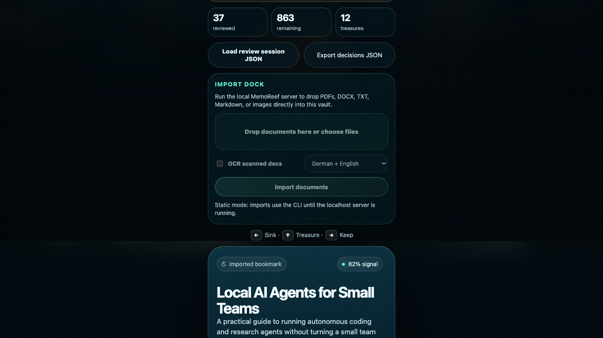
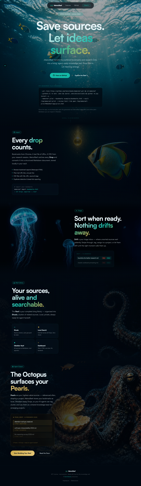
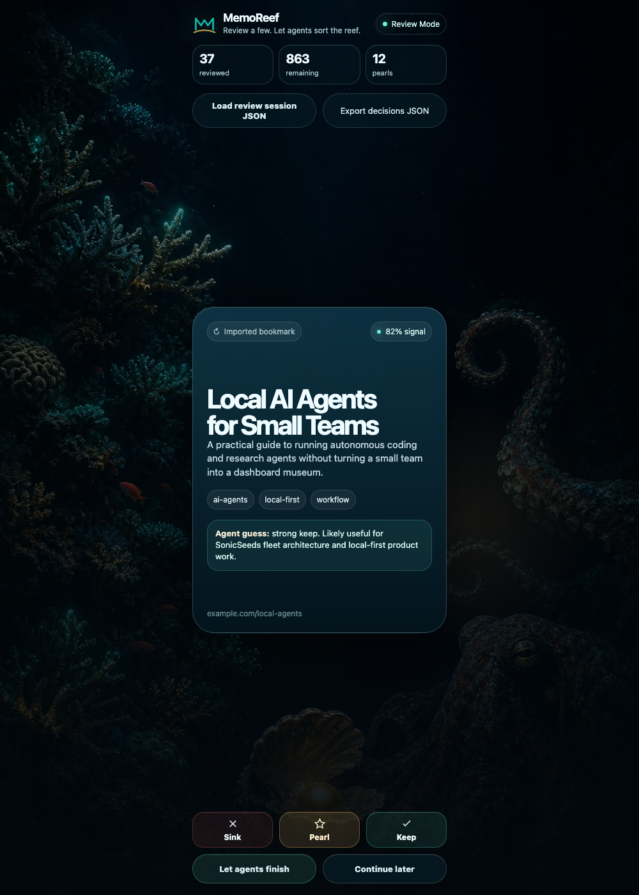
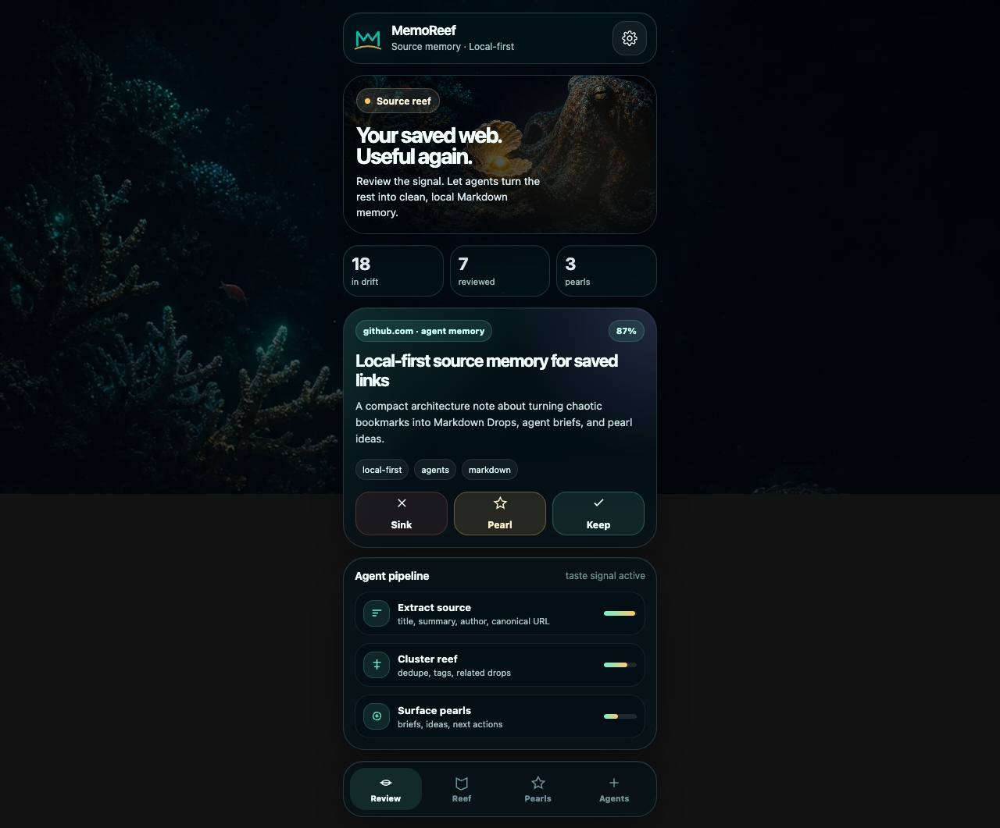

# MemoReef

**Save sources. Let ideas surface.**

MemoReef is local-first research memory for humans and AI agents. It turns saved links, notes, and web sources into a private Markdown source library, so you and your agents can review, connect, cite, and build from trusted context instead of starting from the open web every time.

It is not trying to be another bookmark manager. MemoReef is for people with messy saved research, half-forgotten sources, and projects that need grounded memory.

Want the Obsidian-specific walkthrough? See [Use MemoReef with Obsidian](https://memoreef.de/obsidian.html).

Testing MemoReef for the first time? Use the [Tester Guide](docs/TESTER_GUIDE.md).

## Demo video

[](https://memoreef.de/demo.html)

Watch the 69-second user-ready prototype demo. The video only loads on play.

It shows the local install path, real-source imports, Import Dock, Review Mode, and Markdown output.

## Install and run locally

MemoReef is a local Python app. It does not need a server, account, database, or API key.

Requirements:

- Python 3.11+
- Git

Optional OCR/visual-analysis requirements for scanned PDFs, image files, and PDF figure/table crops:

- Tesseract OCR
- Poppler (`pdftoppm`, `pdfinfo`) for scanned PDF page rendering and PDF page counts
- Tesseract language data for non-English OCR, for example German
- Pillow for optional visual-region crop detection (`python -m pip install -e ".[visual]"`)

On macOS, if `python3 --version` is older than 3.11, install a newer Python first:

```bash
brew install python@3.11
# or: uv python install 3.11
```

On macOS, install OCR tools only if you want `import-docs --ocr` for scanned PDFs or images:

```bash
brew install tesseract poppler tesseract-lang
```

Without these optional OCR tools, MemoReef still imports browser bookmarks, URL lists, CSV files, DOCX, TXT, Markdown, and text-based PDFs.

```bash
git clone https://github.com/SonicSeeds/memoreef.git
cd memoreef
python3.11 -m venv .venv
source .venv/bin/activate
python -m pip install --upgrade pip setuptools
python -m pip install -e .
# optional, for PDF figure/table crop detection:
python -m pip install -e ".[visual]"
```

Create a local pilot vault from the included example bookmarks:

```bash
memoreef pilot --bookmarks examples/bookmarks.html --vault /tmp/memoreef-pilot --review-limit 3
open /tmp/memoreef-pilot/MemoReef/app/pilot.html
```

Or run commands directly from the checkout without installing the console script:

```bash
python3.11 -m memoreef.cli pilot --bookmarks examples/bookmarks.html --vault /tmp/memoreef-pilot --review-limit 3
```

Run Review Mode as a small local app when you want decisions autosaved directly back to the vault:

```bash
python3.11 -m memoreef.cli serve --vault /tmp/memoreef-pilot
open http://127.0.0.1:8765/
```

By default this binds only to `127.0.0.1`, loads up to 50 Drift Drops, and autosaves each Keep/Pearl/Sink decision directly to Markdown frontmatter in the vault. The Review Mode **Tag kept/Pearls** button then saves pending decisions and appends local agent-suggested tags to kept/Pearl Drops through the same filesystem bridge. No account, external network, hosted service, API key, database, or sync layer is required. Treat it as a local filesystem bridge: only run it for vaults you intend MemoReef to edit, and keep the default localhost bind unless you deliberately need otherwise.

The local app also includes **Import Dock**: a drag-and-drop/upload area for PDFs, DOCX, TXT, Markdown, and image files. It writes uploaded files directly into the selected vault as Markdown Drops. Enable OCR in Import Dock for scanned PDFs or images when local OCR tools are installed.



For phone triage on a trusted LAN or Tailscale network, start the same local app on the computer that has the vault:

```bash
python3.11 -m memoreef.cli phone --vault /tmp/memoreef-pilot
```

Each user runs this on their own computer, against their own vault. MemoReef prints phone-friendly URLs such as `http://192.168.x.x:8765/` or `http://100.x.x.x:8765/`, writes the primary URL to `MemoReef/phone-triage-url.txt`, and saves `MemoReef/phone-triage-qr.png` when the optional Python `qrcode` package is available. Open the URL or scan the QR from a phone on the same trusted LAN/Tailscale. Decisions write to that user's local vault through that user's computer.

The lower-level server command is still available:

```bash
python3.11 -m memoreef.cli serve --vault /tmp/memoreef-pilot --mobile
```

The command binds to `0.0.0.0` and warns that the vault write API is reachable from that network. Use it only on a trusted LAN or Tailscale network.

The pilot creates Markdown Drops under:

```text
/tmp/memoreef-pilot/MemoReef/Drops/
```

Import your own browser bookmarks, URL lists, CSV files with `title,url,source,tags` columns, or local documents:

```bash
memoreef import /path/to/bookmarks.html --vault /tmp/memoreef-vault
memoreef import-links /path/to/links.txt --vault /tmp/memoreef-vault
memoreef import-csv /path/to/links.csv --vault /tmp/memoreef-vault
memoreef import-docs /path/to/research.pdf /path/to/brief.docx --vault /tmp/memoreef-vault
memoreef import-docs --ocr /path/to/scanned.pdf /path/to/diagram.png --vault /tmp/memoreef-vault
memoreef import-docs --ocr --ocr-lang deu+eng /path/to/german-scan.pdf --vault /tmp/memoreef-vault
```

`import-docs` turns PDFs, DOCX files, text files, Markdown files, and image files into local Markdown Drops with source-file metadata and a `## Document text` section. It is useful for NotebookLM-style source collection when you want the durable output to stay in your own Markdown/Obsidian memory instead of a hosted notebook. Text-based PDFs work directly. Scanned/image PDFs and image files need `--ocr` plus local OCR tools (`tesseract`; scanned PDFs also need `pdftoppm`/Poppler). Use `--ocr-lang` for non-English documents, for example `deu+eng`.

For research papers, MemoReef also adds a `## Numeric artifacts` section when it can extract table-like numeric rows or when a vision backend returns validated structured numeric data. This section is deliberately separate from visual prose: agents should answer exact-number questions only from quoted source table text or validated numeric artifacts. Machine-extracted CSV tables are candidates and include their source snippet, so agents must preserve context and avoid inventing missing headers. If a chart is only summarized visually and no exact value is present in `## Numeric artifacts`, the correct answer is that the exact value was not extracted.

MemoReef also adds a `## Visual artifacts` section when it sees figure/table captions or table-like text in extracted PDF content. Optional page-image analysis is available through `--vision-command`, which renders the first PDF pages with Poppler, detects large visual regions such as charts/diagrams/tables, crops those regions, and passes each crop to your own local or cloud vision command. If no crop is detected on a page, MemoReef falls back to sending the full rendered page. This is off by default, so MemoReef stays local-first and does not require a vision model.

MemoReef warns when a PDF is large or when the file has more pages than the selected visual-analysis batch. By default it analyzes the first 10 pages; `--vision-page-limit` accepts 1–25.

Example optional vision hook:

```bash
memoreef import-docs paper.pdf --vault /tmp/memoreef-vault \
  --vision-command 'your-vision-cli --image {image} --prompt "{prompt}"' \
  --vision-page-limit 10
```

The command template supports `{image}`, `{page}`, and `{prompt}` placeholders.

## Product shape

MemoReef is a private source memory layer, not a generic bookmark manager:

- **Drops**: saved links or imported bookmarks.
- **Drift**: unsorted inbox state for new Drops.
- **Reef**: the living research memory in Markdown/Obsidian.
- **Deep**: long-term archive state for saved sources.
- **Pearls**: high-value sources worth citing or using in emerging projects.
- **Shoals**: related source clusters.
- **Dive**: local search and retrieval over saved Drops for human reading and agent handoff.

## Current MVP

Implemented:

- Parse Netscape-style browser bookmark HTML exports.
- Import plain text URL lists.
- Import CSV files with title, URL, source provenance, and tags.
- Import local PDF, DOCX, text, Markdown, and OCR-assisted image/scanned-PDF files into source-memory Drops.
- Extract PDF numeric table rows into Numeric artifacts for exact-number answers.
- Extract PDF figure/table captions, table-like text, optional visual-region crops, and optional vision-command descriptions into Visual artifacts sections.
- Preserve folder path as Markdown frontmatter.
- Write one Markdown file per bookmark.
- Store files in an Obsidian-ready folder structure.
- Mark imported items as `status: drift`, `agent_ready: true`, and triage-ready Drop frontmatter.
- Export and apply local Review Mode decisions.
- Serve local Review Mode with direct vault autosave for decisions.
- Generate agent finish plans, deterministic proposal drafts, and local agent tags for kept/Pearl Drops.
- Generate Obsidian hub map notes and Drop-to-hub `[[links]]` so reviewed Drops form visible graph clusters.
- Create duplicate, dead-link, metadata, garden suggestion, and library search reports.
- Generate a refined static local app with dashboard, pilot, tour, library, review, reports, briefs, and Drop detail pages.
- Provide a browser-only Review Mode prototype with sample data until a real review-session JSON is loaded, a non-functional mobile app mockup, and the live cinematic landing page at [memoreef.de](https://memoreef.de/).

Not implemented yet:

- Full article extraction/summarization.
- LLM-generated summaries and deep semantic tagging.
- Browser extension.
- Obsidian plugin.
- Hosted sync or multi-device account layer.

## Built with Codex-assisted development

MemoReef is being built with focused Codex tasks that keep changes small, reviewable, and test-backed. Codex contributes implementation work such as importers, tests, UI prototypes, refactors, and documentation, while Tao/Hermes handles product direction, architecture, taste, verification, and repo orchestration.

See [docs/GRANT_BRIEF.md](docs/GRANT_BRIEF.md) for the grant-oriented project narrative.

For common questions about local-first storage, Obsidian support, agent use, and roadmap scope, see [docs/FAQ.md](docs/FAQ.md).

## Screenshots



| Review Mode local app: autosaves to vault | Mobile app mockup: visual only |
| --- | --- |
|  |  |

## Example output

```markdown
---
title: "Local AI Agents for Small Teams"
url: "https://example.com/local-agents"
type: drop
status: drift
agent_ready: true
pearl: false
folders:
  - "AI Agents"
tags:
  - ai-agents
---

# Local AI Agents for Small Teams

Source: [https://example.com/local-agents](https://example.com/local-agents)

## Summary

_Not enriched yet._

## Notes

## Agent Brief

- Status: Drift
- Suggested next action: triage this Drop.
```

## Development

Run tests:

```bash
python3 -m unittest discover -s tests
```

Run the sample import:

```bash
rm -rf /tmp/memoreef-vault
python3.11 -m memoreef.cli import examples/bookmarks.html --vault /tmp/memoreef-vault
find /tmp/memoreef-vault/MemoReef/Drops -type f
```

Run URL list or CSV imports:

```bash
python3.11 -m memoreef.cli import-links links.txt --vault /tmp/memoreef-vault
python3.11 -m memoreef.cli import-csv links.csv --vault /tmp/memoreef-vault
```

## Pilot: try MemoReef with your bookmarks

Export your bookmarks from your browser as an HTML file. In most browsers this is under Bookmark Manager or Library, then Export Bookmarks.

Run the guided local pilot:

```bash
rm -rf /tmp/memoreef-pilot
python3.11 -m memoreef.cli pilot --bookmarks /path/to/bookmarks.html --vault /tmp/memoreef-pilot --review-limit 25
open /tmp/memoreef-pilot/MemoReef/app/pilot.html
open /tmp/memoreef-pilot/MemoReef/app/tour.html
```

Plain URL lists and CSV exports work too:

```bash
python3.11 -m memoreef.cli pilot --links /path/to/links.txt --vault /tmp/memoreef-pilot
python3.11 -m memoreef.cli pilot --csv /path/to/links.csv --vault /tmp/memoreef-pilot
```

The pilot command imports your export, creates a review session, creates a duplicate report, generates static app pages, and writes `MemoReef/PILOT_README.md`. It is offline-only: no network calls, no AI calls, no backend, and no server.

The generated pilot app pages are self-contained HTML with inline CSS. They are designed as a calm local workspace. The public cinematic landing page lives at [memoreef.de](https://memoreef.de/).

Review a few items with the local app bridge:

```bash
python3.11 -m memoreef.cli serve --vault /tmp/memoreef-pilot --limit 25
open http://127.0.0.1:8765/
```

The local app opens Review Mode, loads Drift Drops from the vault, and autosaves decisions directly back to the Markdown files as you sort.

## Clip highlighted text into your local research memory

Start the local MemoReef server against the vault you want to write to:

```bash
memoreef serve --vault /path/to/vault
```

Then create a browser bookmark named `Clip to Reef` and paste this bookmarklet as the bookmark URL:

```text
javascript:(function(){const d={url:window.location.href,title:document.title,selection:String(window.getSelection())};fetch('http://127.0.0.1:8765/api/drop',{method:'POST',headers:{'Content-Type':'application/json'},body:JSON.stringify(d)}).then(r=>{if(!r.ok)throw new Error();return r.json();}).then(j=>alert(j.clipped?'💧 Highlight clipped to Reef!':'💧 Page dropped to Reef!')).catch(()=>alert('❌ MemoReef local server is not running on http://127.0.0.1:8765.'));})();
```

Highlight useful text on any webpage, click `Clip to Reef`, and MemoReef saves the page title, source URL, and selected passage as a new local Markdown Drop in the connected vault. Highlight clips are marked with `has_clipped_selection: true`, `clip_type: "highlight"`, and a readable `## Clipped selection` block so humans and agents can return to the trusted source context later.

If nothing is highlighted, the same bookmarklet still saves the current page title and URL as a normal Drop.

This is a localhost-only bridge to your own running `memoreef serve` process, not a browser extension, hosted sync service, database, or cloud capture tool.

Phone/LAN/Tailscale mode uses the same real Review Mode and the same local Markdown writes. Each user runs this on their own computer against their own vault:

```bash
python3.11 -m memoreef.cli phone --vault /tmp/memoreef-pilot --limit 25
```

The command prints the phone URLs, saves `MemoReef/phone-triage-url.txt`, optionally saves a QR PNG when the optional `qrcode` package is available, and keeps the local Review Mode server running. The phone talks to that user's computer; that computer writes Keep/Pearl/Sink decisions to that user's local vault.

The lower-level server command is also available:

```bash
python3.11 -m memoreef.cli serve --vault /tmp/memoreef-pilot --limit 25 --lan
```

Keep the server running on the computer with the vault, put the phone on the same trusted LAN or Tailscale network, then open one of the printed `http://<computer-ip>:8765/` URLs on the phone. This is not a hosted sync layer or mobile app.

The browser-only fallback still works. It opens with clearly marked sample data. To review your real bookmarks without running the local server, load one of the JSON files generated by the pilot command:

```bash
open /tmp/memoreef-pilot/MemoReef/review-sessions/
```

In Review Mode, click **Load review session JSON** and select a `*-review-session.json` file from that folder. Do not paste the folder path into Terminal by itself; folder paths are locations, not commands.

After reviewing, export decisions from the browser, then apply them:

```bash
python3.11 -m memoreef.cli apply-review-decisions --vault /tmp/memoreef-pilot --decisions /path/to/memoreef-review-decisions.json --dry-run
python3.11 -m memoreef.cli apply-review-decisions --vault /tmp/memoreef-pilot --decisions /path/to/memoreef-review-decisions.json
python3.11 -m memoreef.cli app --vault /tmp/memoreef-pilot
```

After review, create graph-visible hub notes and reopen the app:

```bash
python3.11 -m memoreef.cli hub-map --vault /tmp/memoreef-pilot --dry-run
python3.11 -m memoreef.cli hub-map --vault /tmp/memoreef-pilot
python3.11 -m memoreef.cli app --vault /tmp/memoreef-pilot
open /tmp/memoreef-pilot/MemoReef/Maps/Emerging\ Hubs.md
```

`hub-map` is local-only. It reads reviewed useful Drops, creates `MemoReef/Maps/Emerging Hubs.md` plus per-hub notes, and writes a generated `MemoReef Connections` section with Obsidian `[[links]]` into linked Drops. Re-running it updates the generated sections instead of duplicating links.

After review, create a small project brief and reopen the app:

```bash
python3.11 -m memoreef.cli brief --vault /tmp/memoreef-pilot --limit 10
python3.11 -m memoreef.cli app --vault /tmp/memoreef-pilot
open /tmp/memoreef-pilot/MemoReef/app/briefs.html
```

Send back feedback from the checklist in `app/pilot.html`: whether import worked, which steps were confusing, whether useful sources surfaced, what was missing, and whether you would use it again.

Open the browser-only Review Mode fallback:

```bash
open site/swipe.html
```

Export a local review session JSON from a vault, then open the browser-only Review Mode and load the JSON with the file picker:

```bash
python3.11 -m memoreef.cli export-review-session --vault /tmp/memoreef-vault
open site/swipe.html
```

The separate mobile app mockup at `site/mobile.html` is visual only. Real phone triage uses the filesystem-backed server above: run `phone` on the computer with the vault and open the printed LAN/Tailscale URL or generated QR on the phone.

Create filtered review sessions for focused queues:

```bash
python3.11 -m memoreef.cli export-review-session --vault /tmp/memoreef-vault --project "AI Agents"
python3.11 -m memoreef.cli export-review-session --vault /tmp/memoreef-vault --shoal "Automation"
python3.11 -m memoreef.cli export-review-session --vault /tmp/memoreef-vault --pearl-only
python3.11 -m memoreef.cli export-review-session --vault /tmp/memoreef-vault --status drift --exclude-status discarded
python3.11 -m memoreef.cli export-review-session --vault /tmp/memoreef-vault --status drift --limit 25
```

Filtered review sessions are local-only and do not modify files. Different filter groups combine together, while repeated values inside one group broaden that group.

Search your local library:

```bash
python3.11 -m memoreef.cli search-library --vault /tmp/memoreef-vault --query "agent workflow"
python3.11 -m memoreef.cli search-library --vault /tmp/memoreef-vault --query "workflow" --project "AI Agents"
python3.11 -m memoreef.cli search-library --vault /tmp/memoreef-vault --query "research" --pearl-only
python3.11 -m memoreef.cli search-library --vault /tmp/memoreef-vault --query "automation" --status drift --exclude-status discarded
```

Library search is local-only and read-only. It searches Markdown Drops and writes JSON results under `MemoReef/search` unless `--output` is provided.

Export selected Drops into a Markdown project brief:

```bash
python3.11 -m memoreef.cli brief --vault /tmp/memoreef-vault --project "AI Agents"
python3.11 -m memoreef.cli brief --vault /tmp/memoreef-vault --project "AI Agents" --pearl-only --limit 10
```

Project briefs are local-only and read-only against Drops. They write Markdown under `MemoReef/briefs/*-project-brief.md` unless `--output` is provided, include source URLs and Drop metadata, and add an Agent handoff section that tells an agent to use only listed sources, cite URLs, note gaps, and avoid invented claims.

Create a complete local demo vault:

```bash
python3.11 -m memoreef.cli demo --output /tmp/memoreef-demo
open /tmp/memoreef-demo/MemoReef/app/pilot.html
open /tmp/memoreef-demo/MemoReef/app/tour.html
open /tmp/memoreef-demo/MemoReef/app/index.html
```

The demo command writes fictional sample Drops and generates local review, duplicate, garden, search, project brief, agent-plan, pilot checklist, product tour, Drop detail, review launcher, reports, briefs, and static app artifacts. Open `MemoReef/app/pilot.html` first for the guided checklist, then use the tour, dashboard, library, review, reports, briefs, and example Drop detail pages. It does not use a backend, network call, AI call, or secrets.

Review Mode can export `memoreef-review-decisions.json` from the browser. The CLI can apply those decisions back to Markdown frontmatter.

Apply exported Review Mode decisions back to Markdown Drop frontmatter:

```bash
python3.11 -m memoreef.cli apply-review-decisions --vault /tmp/memoreef-vault --decisions /tmp/memoreef-review-decisions.json --dry-run
python3.11 -m memoreef.cli apply-review-decisions --vault /tmp/memoreef-vault --decisions /tmp/memoreef-review-decisions.json
```

This updates `status`, `pearl`, and `triaged_at` only. It does not move or delete files.

Tag kept and Pearl Drops with local agent-suggested tags:

```bash
python3.11 -m memoreef.cli tag-reviewed --vault /tmp/memoreef-vault --dry-run
python3.11 -m memoreef.cli tag-reviewed --vault /tmp/memoreef-vault
```

`tag-reviewed` scans Drops that are already kept (`status: reef` or `status: deep`) or marked `pearl: true`, then appends conservative lowercase/hyphen tags from the Drop title, URL, folder path, projects, shoals, page metadata, and note text. It preserves existing tags, skips Drift/Sink items, writes `agent_tagged_at` and `agent_tag_count`, and does not call an external API. In local server Review Mode, the **Tag kept/Pearls** button first saves pending decisions and then calls this same local tagger through `/api/tag-reviewed`.

Create an agent finish plan for the remaining unreviewed Drops:

```bash
python3.11 -m memoreef.cli plan-agent-finish --vault /tmp/memoreef-vault --decisions /tmp/memoreef-review-decisions.json
```

The agent finish plan JSON groups reviewed taste examples into Pearl, Keep, and Sink, then lists the remaining Drops for a later agent task. It does not modify Markdown, and it does not classify the remaining Drops yet.

Draft agent proposals from an agent finish plan:

```bash
python3.11 -m memoreef.cli draft-agent-proposals --plan /tmp/agent-finish-plan.json
```

The agent proposals JSON suggests status, Pearl state, confidence, priority, note location, and rationale for each remaining Drop using deterministic local heuristics.

Apply accepted agent proposals back to Markdown Drop frontmatter:

```bash
python3.11 -m memoreef.cli apply-agent-proposals --vault /tmp/memoreef-vault --proposals /tmp/agent-proposals.json --dry-run
python3.11 -m memoreef.cli apply-agent-proposals --vault /tmp/memoreef-vault --proposals /tmp/agent-proposals.json
```

Proposals marked `requires_user_review: true` are skipped by default. Pass `--include-needs-review` to apply them deliberately. This updates frontmatter only and does not move, delete, or retag files.

Create a local duplicate report:

```bash
python3.11 -m memoreef.cli duplicate-report --vault /tmp/memoreef-vault
```

The duplicate report groups exact canonical URLs, same-domain clusters, and conservative similar-title matches. It is local-only, does not call the network, and does not modify, move, or delete files.

Check saved links directly:

```bash
python3.11 -m memoreef.cli check-links --vault /tmp/memoreef-vault --limit 100 --timeout 5
```

The link check report classifies saved URLs as ok, broken, suspicious, or unknown using direct HTTP HEAD/GET requests to the saved URLs only. It does not use third-party APIs and does not modify, move, or delete files.

Refresh basic page metadata:

```bash
python3.11 -m memoreef.cli refresh-metadata --vault /tmp/memoreef-vault --dry-run
python3.11 -m memoreef.cli refresh-metadata --vault /tmp/memoreef-vault --limit 50 --timeout 5
```

Metadata refresh fetches saved URLs directly, extracts page title, description, canonical URL, and hostname, then updates only the related frontmatter fields. It does not use third-party APIs and does not move, delete, or rewrite notes beyond those metadata fields.

Suggest projects and shoals from existing curated Drops:

```bash
python3.11 -m memoreef.cli suggest-gardens --vault /tmp/memoreef-vault
```

Garden suggestions are local-only heuristic reports. They compare unsorted Drops to Drops that already have projects or shoals, suggest only labels you already use, and do not modify, move, or delete files.

Apply accepted garden suggestions:

```bash
python3.11 -m memoreef.cli apply-garden-suggestions --vault /tmp/memoreef-vault --suggestions /tmp/garden-suggestions.json --dry-run --accept-all
python3.11 -m memoreef.cli apply-garden-suggestions --vault /tmp/memoreef-vault --suggestions /tmp/garden-suggestions.json --accept-project "AI Agents" --accept-shoal "Automation"
```

Applying garden suggestions only writes accepted project and shoal labels from a local suggestion report. It preserves existing labels, does not duplicate labels, and does not modify any other frontmatter fields or Markdown body.

Generate the static local app dashboard:

```bash
python3.11 -m memoreef.cli app --vault /tmp/memoreef-vault
open /tmp/memoreef-vault/MemoReef/app/tour.html
open /tmp/memoreef-vault/MemoReef/app/pilot.html
open /tmp/memoreef-vault/MemoReef/app/index.html
open /tmp/memoreef-vault/MemoReef/app/library.html
open /tmp/memoreef-vault/MemoReef/app/review.html
open /tmp/memoreef-vault/MemoReef/app/reports.html
open /tmp/memoreef-vault/MemoReef/app/briefs.html
```

The app command writes `index.html`, `pilot.html`, `tour.html`, `library.html`, `review.html`, `reports.html`, `briefs.html`, and one generated Drop detail page under `app/drops/` for each local Drop. The pilot page gives early users a guided local checklist; the tour page is generated from local vault data and explains the product story: messy saves, useful Pearls, clutter reports, agent handoff artifacts, project briefs, library search, Drop detail pages, and why local Markdown matters. The dashboard summarizes Drop counts, shows the latest local review/agent/search/brief artifacts, links to the expanded app pages, and points to the next recommended workflow step. It is static HTML and does not start a backend.

The static site prototypes use inline sample data. The generated local app pages are created from real vault files and local JSON artifacts. None of them start a backend.

## Near-term roadmap

1. Robust browser bookmark import across Chrome/Brave/Arc/Firefox/Safari exports.
2. Broader dedupe controls and duplicate reporting across importer types.
3. `enrich` command for title refresh, metadata, summary placeholder, and dead-link checks.
4. Review Mode data model: sink/keep/pearl, let agents finish remaining, and continue sorting later.
5. Obsidian folder conventions and Dataview-friendly frontmatter.
6. Agent handoff format: project briefings generated from selected Drops/Shoals.
7. Optional UI: local web app or Tauri app for Drift triage.

## License

MIT, unless changed before public release.
